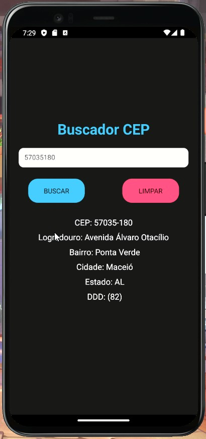
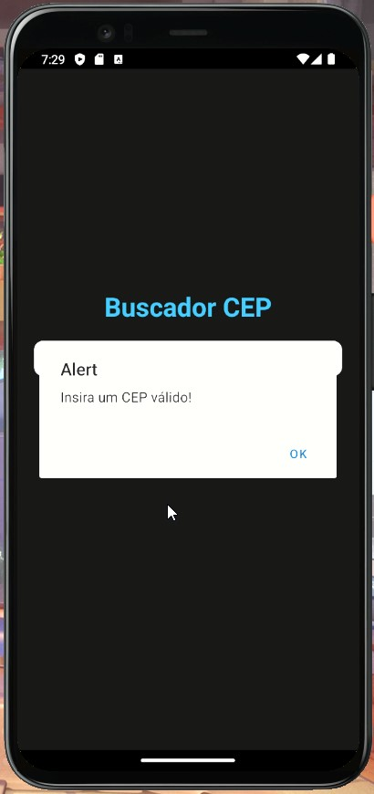

# 📍Buscador de CEP (ZIP Code Finder)
* Trata-se de um aplicativo que tem como objetivo a consulta de CEP. Ao pesquisar um CEP é retonado o logradouro, bairro, nome da cidade, nome do estado e DDD. A pesquisa do CEP é feita através de uma API.

* It is an application that aims to consult ZIP codes. When searching for a ZIP code, the street, neighborhood, name of the city, name of the state and area coode are returned. The zip code search is done through an API.

    
    

## Download⬇️
* <a href="src/ReadmeSrc/bucador_cep_demo.mp4" download>Download do vídeo demo do aplicativo</a>
* <a href="src/ReadmeSrc/bucador_cep_demo.mp4" download>Download here a demo video of the App</a>

## Tecnologias (Technologies)💻
* React Native (expo-cli)
* Axios
## Contato (Contact me)🔗
* Email: gabriel.avilaa27@gmail.com
* LinkedIn: https://www.linkedin.com/in/gabriel-avila-10a077218/
